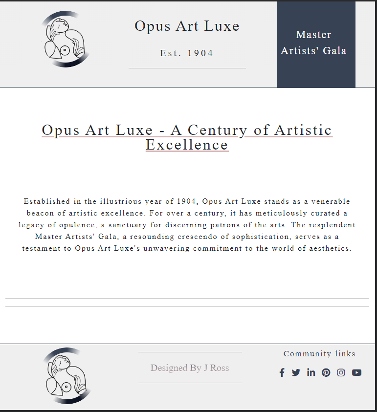
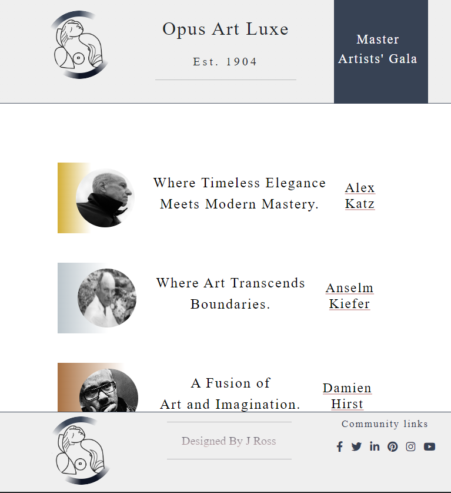
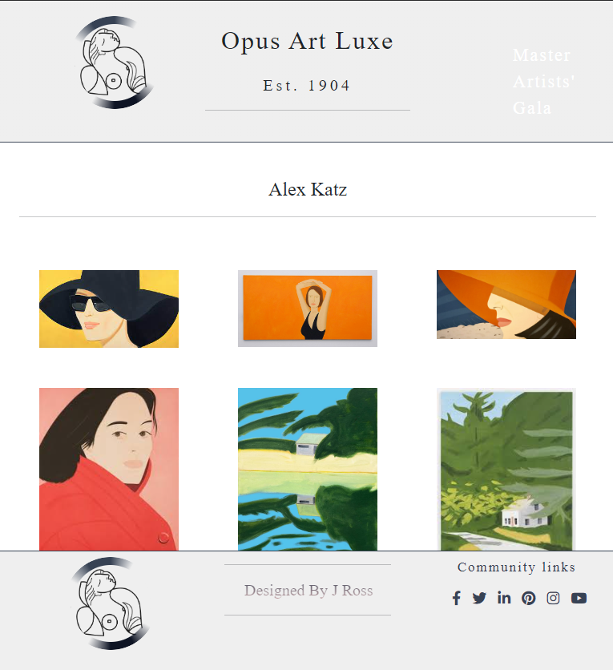

Certainly! Including screenshots can provide a visual overview of the project. Here’s an updated draft for the README file:

markdown
# Opus Art Luxe Art Gallery Website

This repository contains the source code and assets for the [Opus Art Luxe Art Gallery Website](https://jesseross001.github.io/Art-Gallary-Design/). Opus Art Luxe, established in 1904, stands as a venerable beacon of artistic excellence, curating a legacy of opulence for discerning patrons of the arts.

## Screenshots

## Features
- Overview of Opus Art Luxe's history and mission
- Display of featured artists and their artworks
- Contact information for inquiries
- Community links to social media profiles

## Pages
- Home: A welcoming page with a brief introduction to Opus Art Luxe
- Artists: Showcasing the featured artists and their masterpieces
- Enquiries: Contact information for patrons and artists interested in collaborating

## Technologies Used
- HTML
- CSS
- JavaScript

## Contributing
If you'd like to contribute, please fork the repository and use a feature branch. Pull requests are warmly welcome.

## Links
- Repository: https://github.com/jesseross001/Art-Gallary-Design
- Issue tracker: https://github.com/jesseross001/Art-Gallary-Design/issues

## Licensing
The code in this project is licensed under MIT license. See the [LICENSE](LICENSE.md) file for more information.

## Author
- Jesse Ross - jesseross001@gmail.com

## Acknowledgements
- Icons provided by [IconMonster](http://iconmonstr.com/)
- Images sourced from various artists and online platforms
